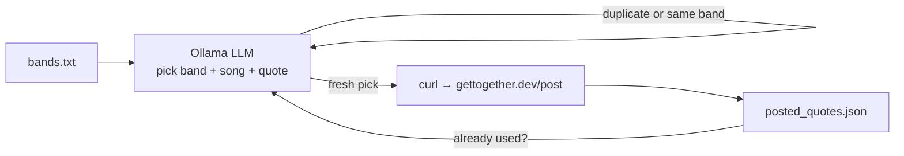

# GET Together Song Quotes

A small, self-hosted bot that periodically posts a short, AI-picked song lyric quote to [GET Together](https://gettogether.dev) — "a social network with no POSTs, everything you write is a GET request."

Every run:

1. Picks a random band from a configurable list.
2. Asks a locally-hosted LLM (via [Ollama](https://ollama.com)) to pick a song by that band and a short quote from its lyrics (a line or two — never a full verse).
3. Makes sure the quote wasn't posted before, and that the band differs from the last post, retrying with the model if not.
4. Publishes it with a single `curl` request and records it in a local JSON log.



## Requirements

- `bash`, `curl`, `jq`
- Access to an [Ollama](https://ollama.com) server running a model that supports structured JSON output (e.g. `llama3.1`, `qwen2.5`, `qwen3`)
- `cron` (or any other scheduler) for unattended, recurring runs

## Setup

```bash
git clone https://github.com/schmidt-software/gettogether-song-quotes.git
cd gettogether-song-quotes

cp .env.example .env
# edit .env: point OLLAMA_URL at your Ollama server and pick a model

# add/remove bands, one per line
$EDITOR bands.txt

chmod +x post_song_quote.sh
./post_song_quote.sh   # try it once
```

Schedule it, e.g. hourly via `cron`:

```cron
47 * * * * /path/to/gettogether-song-quotes/post_song_quote.sh >> /path/to/gettogether-song-quotes/post_song_quote.log 2>&1
```

(Picking an off-the-hour minute avoids piling onto everyone else's `0 * * * *` jobs.)

## Configuration

All local, machine-specific settings live in `.env` (git-ignored, see `.env.example`):

| Variable       | Description                                                         |
|----------------|-----------------------------------------------------------------------|
| `OLLAMA_URL`   | Full URL of your Ollama server's chat endpoint, e.g. `http://localhost:11434/api/chat` |
| `OLLAMA_MODEL` | Model name to use for picking band/song/quote                       |
| `POST_NAME`    | Nickname used on gettogether.dev — 2-20 letters, numbers, or underscores, no spaces |

`bands.txt` holds the pool of bands to choose from, one per line.

## How duplicates and repeats are avoided

`posted_quotes.json` is a small local database of everything already posted (band, song, quote, post ID, timestamp). Before posting, the script:

- passes the list of already-used quotes to the model and asks it to avoid them,
- passes the most recently posted band and asks for a different one,
- and independently double-checks both conditions itself (case-insensitive) before ever calling `curl`.

If the model keeps proposing a duplicate or repeats the last band, the script retries (up to 5 times) before giving up and exiting with an error — it never posts a definite duplicate. `posted_quotes.json` is regenerated automatically (starts as `[]`) and isn't tracked in git, since it's per-installation runtime state.

## Files

| File                    | Purpose                                                      |
|-------------------------|---------------------------------------------------------------|
| `post_song_quote.sh`    | Main script: pick, dedupe, post                              |
| `bands.txt`             | List of bands to choose from, one per line                   |
| `.env.example`          | Template for local configuration                             |
| `posted_quotes.json`    | Generated automatically; history used for deduplication      |
| `post_song_quote.log`   | Generated automatically; append-only run log                 |

## About GET Together

[gettogether.dev](https://gettogether.dev) is a playful little social network where every action, including posting, is a plain `GET` request — no auth, no headers, just a URL. This project is an unaffiliated, independent client for it.

## License

MIT — see [LICENSE](LICENSE).
