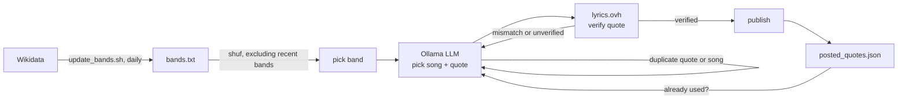

<div align="center">
  
</div>

# Song Quote Bot

A small, self-hosted bot that periodically picks a short, AI-selected song lyric quote and publishes it to one or more configured platforms — currently [GET Together](https://gettogether.dev) ("a social network with no POSTs, everything you write is a GET request") and [Mastodon](https://joinmastodon.org).

See it in action on Mastodon: [@songquotebot@mastodon.social](https://mastodon.social/@songquotebot)

Every run:

1. Picks a random band from a configurable list — chosen locally with true uniform randomness, not by the LLM (see below).
2. Asks a locally-hosted LLM (via [Ollama](https://ollama.com)) to pick a song by that band and a short quote from its lyrics (a line or two — never a full verse).
3. Makes sure neither the quote nor the song was used before for that band, retrying with the model if so.
4. Publishes it and records it in a local JSON log.



## Roadmap

- [x] Post to GET Together
- [x] Post to Mastodon
- [x] Pluggable output targets, configurable per run

## Requirements

- `bash`, `curl`, `jq`, `iconv` (part of glibc on virtually every Linux system)
- Access to an [Ollama](https://ollama.com) server running a model that supports structured JSON output (e.g. `llama3.1`, `qwen2.5`, `qwen3`)
- `cron` (or any other scheduler) for unattended, recurring runs

## Setup

```bash
git clone https://github.com/schmidt-software/song-quote-bot.git
cd song-quote-bot

cp .env.example .env
# edit .env: point OLLAMA_URL at your Ollama server and pick a model

chmod +x post_song_quote.sh update_bands.sh
./update_bands.sh       # generate bands.txt from Wikidata
./post_song_quote.sh    # try it once
```

Schedule both via `cron` — posting hourly, the band list refreshed daily:

```cron
47 * * * * /path/to/song-quote-bot/post_song_quote.sh >> /path/to/song-quote-bot/post_song_quote.log 2>&1
17 3 * * * /path/to/song-quote-bot/update_bands.sh >> /path/to/song-quote-bot/post_song_quote.log 2>&1
```

(Picking an off-the-hour minute avoids piling onto everyone else's `0 * * * *` jobs.)

## Configuration

All local, machine-specific settings live in `.env` (git-ignored, see `.env.example`):

| Variable                 | Description                                                         |
|--------------------------|-----------------------------------------------------------------------|
| `OLLAMA_URL`             | Full URL of your Ollama server's chat endpoint, e.g. `http://localhost:11434/api/chat` |
| `OLLAMA_MODEL`           | Model name to use for picking band/song/quote                       |
| `POST_TARGETS`           | Comma-separated list of platforms to post to: `gettogether`, `mastodon` (default: `gettogether`) |
| `POST_NAME`              | Nickname used on gettogether.dev — 2-20 letters, numbers, or underscores, no spaces |
| `MASTODON_URL`           | Base URL of your Mastodon instance (only needed if `mastodon` is in `POST_TARGETS`) |
| `MASTODON_ACCESS_TOKEN`  | Access token with the `write:statuses` scope — create one under *Settings → Development → New Application* on your instance |

`bands.txt` holds the pool of bands to choose from, one per line - it's git-ignored (like `.env`), so your personal list stays local. It's auto-generated by `update_bands.sh` (see below) rather than hand-maintained; `bands.txt.example` is only a small fallback seed for a fresh checkout before `update_bands.sh` has run for the first time.

Each configured target is posted to independently — if one is down or misconfigured, the others still go out; the outcome of every target (success or error) is recorded per post in `posted_quotes.json` and printed to the log. The run only counts as failed, and gets retried, if *every* configured target fails.

The Mastodon post is formatted a bit differently from GET Together's: a couple of music emoji, then two line breaks, then the hashtags `#songquote #songcite`. GET Together's post text is unaffected.

> **Note:** Mastodon support has been verified against a real instance/account (post + delete, and the invalid-token error path).

## Where the band list comes from

`update_bands.sh` refreshes `bands.txt` from [Wikidata](https://www.wikidata.org) — a SPARQL query for musical groups tagged with a rock/metal/punk-rock/hard-rock genre, ranked by sitelink count (a decent cross-language popularity proxy) and capped at the top 200. Wikidata's data is CC0, so there's no attribution/ToS concern, and the list stays reasonably current as Wikidata itself gets edited, without anyone having to hand-maintain a band list.

Run it separately from `post_song_quote.sh` (e.g. once daily via `cron`, see above) — Wikidata's public endpoint isn't meant for hourly hammering. If the query fails or comes back empty, the existing `bands.txt` is left untouched rather than wiped, so a transient Wikidata outage never blocks a post.

Automatic genre-based tagging occasionally pulls in an act you might not want representing your bot (e.g. one tied to real-world criminal/extremist notoriety). To permanently exclude specific names, list them (one per line) in an optional, git-ignored `bands_exclude.txt` — `update_bands.sh` filters them out of every refresh.

## How variety is enforced

LLMs asked to "pick randomly" reliably gravitate towards the single most famous/typical example instead of sampling uniformly — in practice this meant one band and one song got picked far more often than the rest. To counter that:

- **Band:** chosen in the script itself with `shuf`, excluding the most recently used bands from the draw — not left to the model.
- **Song:** the model is told which songs of the chosen band were already posted and asked to pick a different one.
- **Quote:** the model is told which quotes were already posted and asked to avoid them.

`posted_quotes.json` is a small local database of everything already posted (band, song, quote, per-platform result, timestamp) that backs all three checks. The script independently re-verifies the model's song and quote choice against it (case-insensitive) before ever publishing — if the model repeats a song or quote anyway, the script retries (up to `MAX_ATTEMPTS` times) rather than posting a known duplicate. `posted_quotes.json` is regenerated automatically (starts as `[]`) and isn't tracked in git, since it's per-installation runtime state.

## Lyrics verification (and its limits)

The LLM picks a quote from what it remembers about a song, not from an authoritative source - in practice it has invented plausible-sounding lines that don't actually appear in the song. Mitigations:

- The prompt explicitly forbids invented lines and tells the model to pick a different song of the same band if it's unsure of the exact wording; the sampling temperature is a conservative `0.7` (lowered from `1.1` once band/song variety became the script's job instead of the model's, since a high temperature was then only adding hallucination risk).
- Before ever publishing, the script checks the quote against [lyrics.ovh](https://api.lyrics.ovh) (a free, keyless lyrics API). Text is normalized (accents transliterated the way the API does it, e.g. "bück" → "buck"; case and punctuation ignored) before comparing. The result - `verified`, `mismatch`, or `unverified` - is logged and, for a post that goes out, stored under `lyrics_check` in `posted_quotes.json`:
  - **`verified`** — the quote was found in the fetched lyrics → posted.
  - **`mismatch`** — lyrics were found, but the quote isn't in them (likely hallucinated) → rejected and retried with a different pick.
  - **`unverified`** — no lyrics available for that band/song (common for niche/local acts, or when the API's title matching doesn't find a match) → **also rejected and retried**, same as a mismatch. Only a `verified` quote actually gets posted.

**Trade-off:** requiring `verified` means bands with no coverage in lyrics.ovh (typically small/local/regional acts) can never successfully post - every attempt for them ends in `unverified` → retry. `MAX_ATTEMPTS` (currently `10`) exists to absorb this: a run tries up to that many band/song/quote combinations before giving up entirely for that hour (logged as an error, nothing posted). If your `bands.txt` leans heavily towards niche acts, expect some hours to fail outright.

**Even `verified` isn't an absolute guarantee** - lyrics.ovh is a single, community-sourced transcription and can itself be incomplete or differ from the "real" wording (famously ambiguous/mumbled lines, condensed repeated hooks, etc.). If you spot a wrong quote, remove its entry from `posted_quotes.json` and, if already published, delete it from the platform(s) directly.

## Files

| File                    | Purpose                                                      |
|-------------------------|---------------------------------------------------------------|
| `post_song_quote.sh`    | Main script: pick, dedupe, post                              |
| `update_bands.sh`       | Refreshes `bands.txt` from Wikidata; run separately (e.g. daily) |
| `bands.txt.example`     | Fallback seed used before `update_bands.sh` has run for the first time |
| `bands.txt`             | Generated by `update_bands.sh`; git-ignored list of bands to choose from, one per line |
| `bands_exclude.txt`     | Optional, git-ignored: bands to always exclude from `bands.txt`, one per line |
| `.env.example`          | Template for local configuration                             |
| `posted_quotes.json`    | Generated automatically; history used for deduplication      |
| `post_song_quote.log`   | Generated automatically; append-only run log                 |

## About GET Together

[gettogether.dev](https://gettogether.dev) is a playful little social network where every action, including posting, is a plain `GET` request — no auth, no headers, just a URL. This project is an unaffiliated, independent client for it.

## License

MIT — see [LICENSE](LICENSE).
