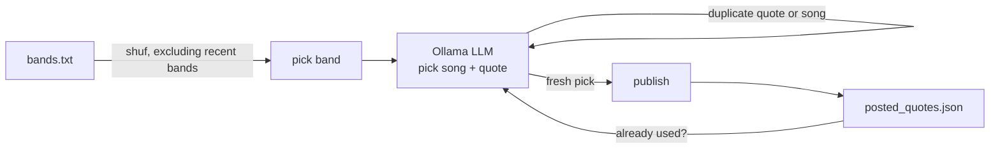

# Song Quote Bot

A small, self-hosted bot that periodically picks a short, AI-selected song lyric quote and publishes it to one or more configured platforms — currently [GET Together](https://gettogether.dev) ("a social network with no POSTs, everything you write is a GET request") and [Mastodon](https://joinmastodon.org).

Every run:

1. Picks a random band from a configurable list — chosen locally with true uniform randomness, not by the LLM (see below).
2. Asks a locally-hosted LLM (via [Ollama](https://ollama.com)) to pick a song by that band and a short quote from its lyrics (a line or two — never a full verse).
3. Makes sure neither the quote nor the song was used before for that band, retrying with the model if so.
4. Publishes it and records it in a local JSON log.



## Roadmap

- [x] Post to GET Together
- [x] Post to Mastodon
- [x] Pluggable output targets, configurable per run

## Requirements

- `bash`, `curl`, `jq`
- Access to an [Ollama](https://ollama.com) server running a model that supports structured JSON output (e.g. `llama3.1`, `qwen2.5`, `qwen3`)
- `cron` (or any other scheduler) for unattended, recurring runs

## Setup

```bash
git clone https://github.com/schmidt-software/song-quote-bot.git
cd song-quote-bot

cp .env.example .env
# edit .env: point OLLAMA_URL at your Ollama server and pick a model

# add/remove bands, one per line
$EDITOR bands.txt

chmod +x post_song_quote.sh
./post_song_quote.sh   # try it once
```

Schedule it, e.g. hourly via `cron`:

```cron
47 * * * * /path/to/song-quote-bot/post_song_quote.sh >> /path/to/song-quote-bot/post_song_quote.log 2>&1
```

(Picking an off-the-hour minute avoids piling onto everyone else's `0 * * * *` jobs.)

## Configuration

All local, machine-specific settings live in `.env` (git-ignored, see `.env.example`):

| Variable                 | Description                                                         |
|--------------------------|-----------------------------------------------------------------------|
| `OLLAMA_URL`             | Full URL of your Ollama server's chat endpoint, e.g. `http://localhost:11434/api/chat` |
| `OLLAMA_MODEL`           | Model name to use for picking band/song/quote                       |
| `POST_TARGETS`           | Comma-separated list of platforms to post to: `gettogether`, `mastodon` (default: `gettogether`) |
| `POST_NAME`              | Nickname used on gettogether.dev — 2-20 letters, numbers, or underscores, no spaces |
| `MASTODON_URL`           | Base URL of your Mastodon instance (only needed if `mastodon` is in `POST_TARGETS`) |
| `MASTODON_ACCESS_TOKEN`  | Access token with the `write:statuses` scope — create one under *Settings → Development → New Application* on your instance |

`bands.txt` holds the pool of bands to choose from, one per line.

Each configured target is posted to independently — if one is down or misconfigured, the others still go out; the outcome of every target (success or error) is recorded per post in `posted_quotes.json` and printed to the log. The run only counts as failed, and gets retried, if *every* configured target fails.

The Mastodon post gets `#songquote` appended to the text; GET Together's post is unaffected.

> **Note:** Mastodon support has been verified against a real instance/account (post + delete, and the invalid-token error path).

## How variety is enforced

LLMs asked to "pick randomly" reliably gravitate towards the single most famous/typical example instead of sampling uniformly — in practice this meant one band and one song got picked far more often than the rest. To counter that:

- **Band:** chosen in the script itself with `shuf`, excluding the most recently used bands from the draw — not left to the model.
- **Song:** the model is told which songs of the chosen band were already posted and asked to pick a different one.
- **Quote:** the model is told which quotes were already posted and asked to avoid them.

`posted_quotes.json` is a small local database of everything already posted (band, song, quote, per-platform result, timestamp) that backs all three checks. The script independently re-verifies the model's song and quote choice against it (case-insensitive) before ever publishing — if the model repeats a song or quote anyway, the script retries (up to 5 times, with a slightly increased sampling temperature) rather than posting a known duplicate. `posted_quotes.json` is regenerated automatically (starts as `[]`) and isn't tracked in git, since it's per-installation runtime state.

## Files

| File                    | Purpose                                                      |
|-------------------------|---------------------------------------------------------------|
| `post_song_quote.sh`    | Main script: pick, dedupe, post                              |
| `bands.txt`             | List of bands to choose from, one per line                   |
| `.env.example`          | Template for local configuration                             |
| `posted_quotes.json`    | Generated automatically; history used for deduplication      |
| `post_song_quote.log`   | Generated automatically; append-only run log                 |

## About GET Together

[gettogether.dev](https://gettogether.dev) is a playful little social network where every action, including posting, is a plain `GET` request — no auth, no headers, just a URL. This project is an unaffiliated, independent client for it.

## License

MIT — see [LICENSE](LICENSE).
